#  Welcome to My Digital Universe!

<div align="center">

## 🚀 I'm **CHVKR SUBASH** 
### `Data Science Enthusiast` • `Python Developer` • `UI/UX Learner` • `Cloud Explorer`


</div>

## 🌟 About Me


```python
class DataScientist:
    def __init__(self):
        self.name = "CHVKR Subash"
        self.role = "Data Science Enthusiast"
        self.language_spoken = ["Python", "R", "SQL", "JavaScript"]
        self.current_focus = ["AI/ML", "Cloud Computing", "UI/UX Design"]
        self.fun_fact = "I automated my coffee routine with Python!"
    
    def say_hi(self):
        print("Thanks for dropping by! Let's build something amazing together!")

me = DataScientist()
me.say_hi()
```

<br><br><br>

## 🛠️ Tech Arsenal

<div align="center">

### 📊 Data Science & Analytics

<br>


### ☁️ Cloud & DevOps


### 🎨 Frontend & Design


### 🗄️ Databases & Tools


</div>


## 🔥 GitHub Stats

<div align="center">
  
  
</div>

<div align="center">
  
</div>

## 🏆 GitHub Trophies
<div align="center">
  
</div>


## 📈 Contribution Graph

<div align="center">
  
</div>

## 🌟 Featured Projects

<div align="center">

<a href="https://github.com/chvkrsubhash/awesome-project-1">
  
</a>

<a href="https://github.com/chvkrsubhash/awesome-project-2">
  
</a>

</div>

## 🎯 Current Focus & Goals

```mermaid
mindmap
  root((CHVKR Subash))
    🤖 AI & ML
      TensorFlow
      PyTorch
      Deep Learning
      NLP
    ☁️ Cloud Computing
      AWS Certification
      Azure Services  
      GCP Projects
      Serverless Architecture
    📊 Data Science
      Advanced Analytics
      ML Model Deployment
      Data Visualization
      Big Data Processing
    🎨 UI/UX Design
      User Research
      Prototyping
      Design Systems
      Accessibility
```

<div align="center">



</div>

## 🏅 Certifications & Achievements

<div align="center">

| 🏆 Certification | 🏢 Provider | 📅 Status |
|---|---|---|
|  | Microsoft | ✅ Completed |
|  | Amazon Web Services | 🯠In Progress |
|  | Google Cloud | 📚 Planning |

</div>

## 🌐 Connect With Me

<div align="center">

<a href="https://www.linkedin.com/in/v-k-r-subhash-ch-68533a288/">
  
</a>
<a href="https://github.com/chvkrsubhash">
  
</a>
<a href="https://leetcode.com/u/chvkrsubhash/">
  
</a>
<a href="https://g.dev/chvkrsubhash">
  
</a>
<a href="https://www.cloudskillsboost.google/public_profiles/32d2cf65-a3f9-430d-bd11-350ac4a41674">
  
</a>
<a href="https://chvkrsubhash.netlify.app/">
  
</a>
<a href="mailto:chvkrsubhash@outlook.com">
  
</a>

</div>

## 💡 Fun Facts & Random Stuff

<div align="center">


</div>

### 🎲 Random Dev Joke
<div align="center">

</div>

### 🐍 Contribution Snake
<div align="center">
  
</div>

## 📊 Weekly Development Breakdown

<!--START_SECTION:waka-->
```text
Python           8 hrs 42 mins   ████████████░░░░░░░░░░░░░   48.23 %
SQL              3 hrs 15 mins   ████░░░░░░░░░░░░░░░░░░░░░   18.06 %
JavaScript       2 hrs 30 mins   ███░░░░░░░░░░░░░░░░░░░░░░   13.89 %
R                1 hr 45 mins    ██░░░░░░░░░░░░░░░░░░░░░░░   09.72 %
Jupyter Notebook 1 hr 20 mins   ██░░░░░░░░░░░░░░░░░░░░░░░   07.41 %
Other            30 mins         █░░░░░░░░░░░░░░░░░░░░░░░░   02.69 %
```
<!--END_SECTION:waka-->

## 🎵 Currently Vibing To

<div align="center">
  
</div>

---

<div align="center">

### 💫 *"The best time to plant a tree was 20 years ago. The second best time is now."*


**Thanks for visiting! 🌟 Don't forget to ⭐ some repositories if you found them interesting!**


</div>
